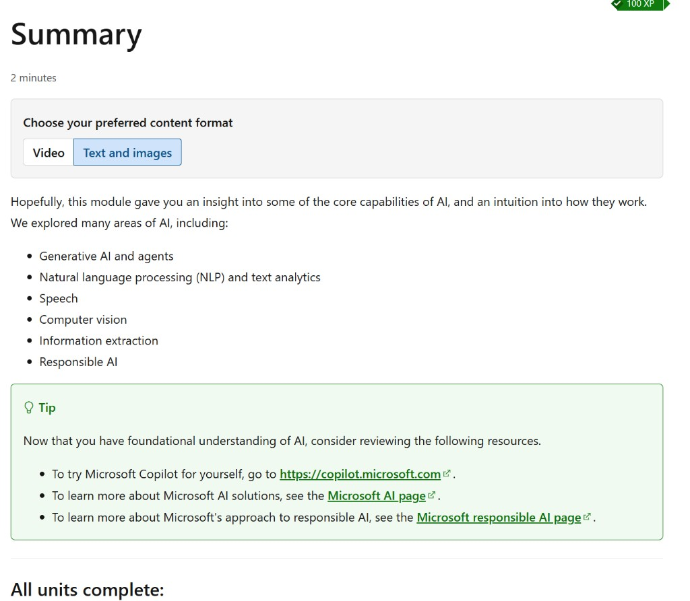

# Summary

**100 XP** · *Estimated time: 2 minutes*

**Choose your preferred content format:** Video, or **Text and images** (the text version often includes more detail than the videos, so you can use it as supplemental material.)

Hopefully, this module gave you an insight into some of the core capabilities of AI, and an intuition into how they work.

We explored many areas of AI, including:

- Generative AI and agents
- Natural language processing (NLP) and text analytics
- Speech
- Computer vision
- Information extraction
- Responsible AI

> **Tip:** Now that you have foundational understanding of AI, consider reviewing the following resources.
>
> - To try Microsoft Copilot for yourself, go to **https://copilot.microsoft.com**.
> - To learn more about Microsoft AI solutions, see the **[Microsoft AI page](https://www.microsoft.com/en-us/ai)**.
> - To learn more about Microsoft’s approach to responsible AI, see the **[Microsoft responsible AI page](https://www.microsoft.com/en-us/ai/responsible-ai)**.

---

## All units complete:
