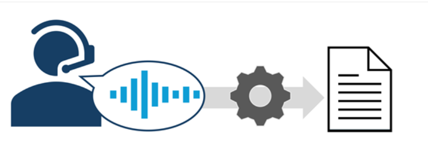
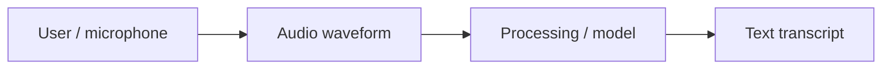
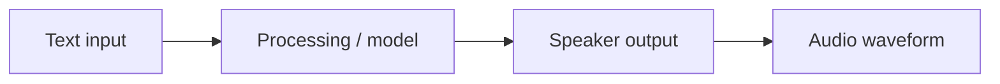

# Speech

Speech capabilities in AI applications and agents enable users to interact with them through spoken language.

## Speech recognition

Spoken input is processed and converted into text (speech-to-text).

Speech recognition is the ability of AI to "hear" and interpret speech. Usually this capability takes the form of *speech-to-text* (where the audio signal for the speech is transcribed into text).

## Speech synthesis

Text is processed and converted into audible speech (text-to-speech).

Speech synthesis is the ability of AI to vocalize words as spoken language. Usually this capability takes the form of *text-to-speech*, in which information in text format is converted into an audible signal.

AI speech technology is evolving rapidly to handle challenges like ignoring background noise, detecting interruptions, and generating increasingly expressive and human-like voices.

## AI speech scenarios

Common uses of AI speech technologies include:

- **AI agents** — systems that understand spoken input, perform tasks, and respond with spoken results.
- **Automated transcription** — of calls or meetings.
- **Audio descriptions** — automating narration of video or text.
- **Speech translation** — automated translation between spoken languages.
