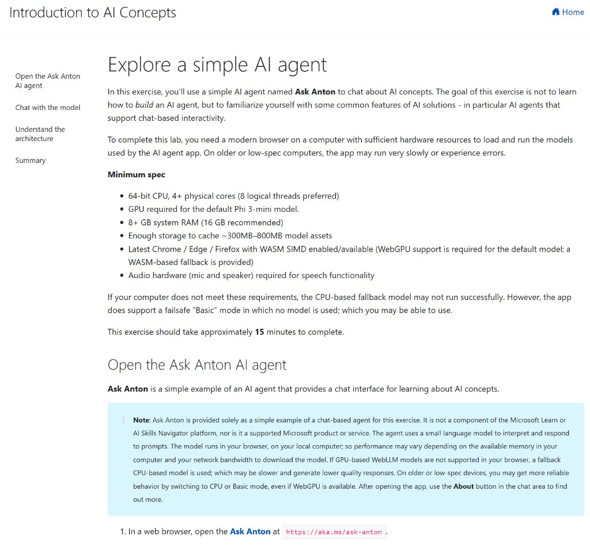
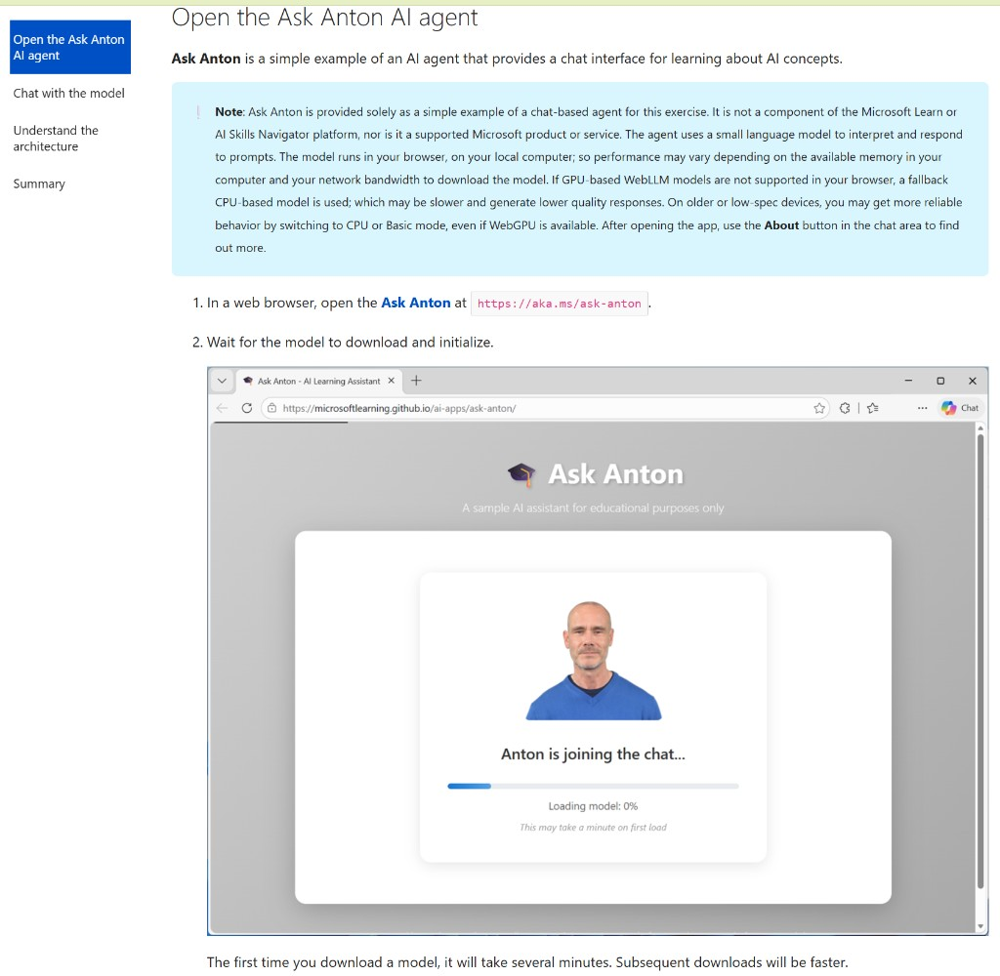
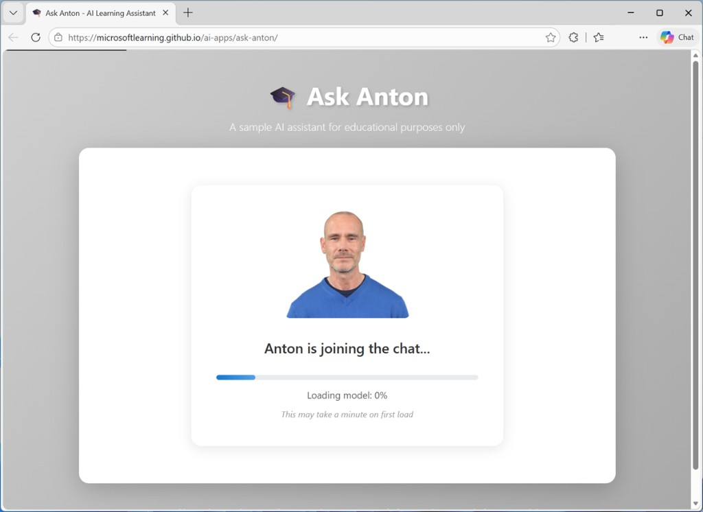
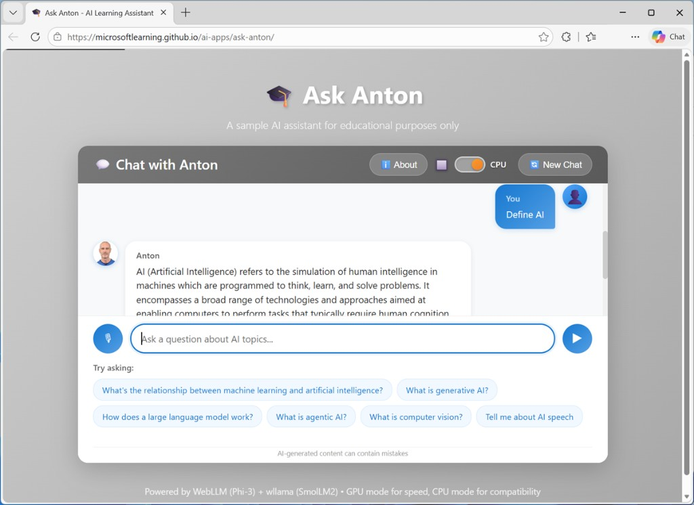
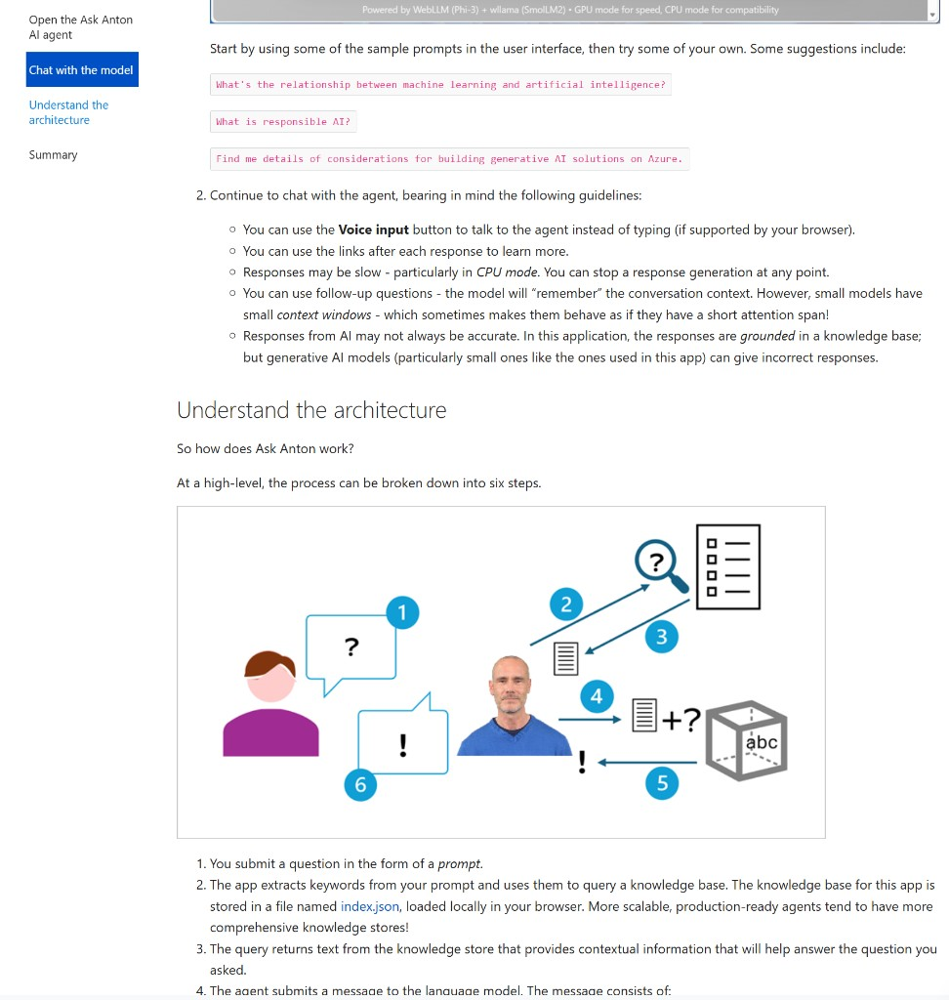
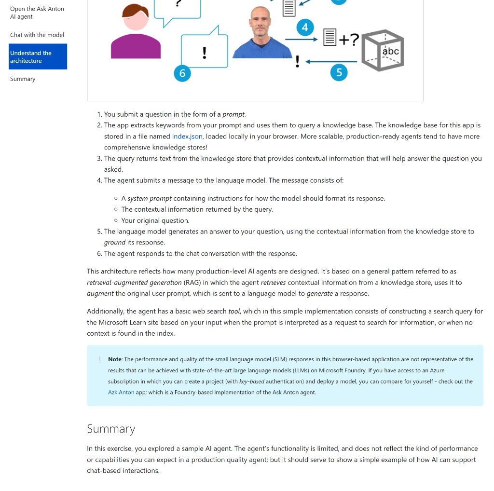

# Explore a simple AI agent

In this exercise, you’ll use a simple AI agent named **Ask Anton** to chat about AI concepts. The goal of this exercise is not to learn how to build an AI agent, but to familiarize yourself with some common features of AI solutions—in particular AI agents that support chat-based interactivity.

To complete this lab, you need a modern browser on a computer with sufficient hardware resources to load and run the models used by the AI agent app. On older or low-spec computers, the app may run very slowly or experience errors.

*Estimated reading time: 15 minutes*

## Minimum spec

- **64-bit CPU**, 4+ physical cores (8 logical threads preferred)
- **GPU** required for the default Phi 3-mini model
- **8+ GB** system RAM (16 GB recommended)
- Enough storage to cache **~300MB–800MB** model assets
- Latest **Chrome / Edge / Firefox** with WASM SIMD enabled/available (WebGPU support is required for the default model; a WASM-based fallback is provided)
- **Audio hardware** (mic and speaker) required for speech functionality

If your computer does not meet these requirements, the CPU-based fallback model may not run successfully. However, the app does support a failsafe **Basic** mode in which no model is used, which you may be able to use.

This exercise should take approximately **15 minutes** to complete.

## Open the Ask Anton AI agent

Ask Anton is a simple example of an AI agent that provides a chat interface for learning about AI concepts.

> **Note:** Ask Anton is provided solely as a simple example of a chat-based agent for this exercise. It is not a component of the Microsoft Learn or AI Skills Navigator platform, nor is it a supported Microsoft product or service. The agent uses a small language model to interpret and respond to prompts. The model runs in your browser, on your local computer; so performance may vary depending on the available memory in your computer and your network bandwidth to download the model. If GPU-based WebLLM models are not supported in your browser, a fallback CPU-based model is used, which may be slower and generate lower quality responses. On older or low-spec devices, you may get more reliable behavior by switching to CPU or Basic mode, even if WebGPU is available. After opening the app, use the **About** button in the chat area to find out more.

1. In a web browser, open **Ask Anton** at `https://aka.ms/ask-anton`.
2. Wait for the model to download and initialize.

The first time you download a model, it will take several minutes. Subsequent downloads will be faster.

## Chat with the model

> **Tip:** If the GPU-based model fails to load, the app will fallback to CPU mode. This may happen if your computer does not have a GPU, or if WebGPU support is disabled in your browser. When using an ARM64 based computer, you may need to enable WebGPU support in your browser’s `edge://flags` or `chrome://flags` page and restart the browser. If you choose to do so, disable it again when you have completed the exercise.

1. When the model is ready, use the chat interface to enter questions related to AI concepts, and review the responses returned by the agent.

Start by using some of the sample prompts in the user interface, then try some of your own. Some suggestions include:

- `What's the relationship between machine learning and artificial intelligence?`
- `What is responsible AI?`
- `Find me details of considerations for building generative AI solutions on Azure.`

Continue to chat with the agent, bearing in mind the following guidelines:

- You can use the **Voice input** button to talk to the agent instead of typing (if supported by your browser).
- You can use the links after each response to learn more.
- Responses may be slow—particularly in **CPU** mode. You can stop response generation at any point.
- You can use follow-up questions—the model will “remember” the conversation context. However, small models have small *context windows*, which sometimes makes them behave as if they have a short attention span.
- Responses from AI may not always be accurate. In this application, the responses are *grounded* in a knowledge base; but generative AI models (particularly small ones like the ones used in this app) can give incorrect responses.

## Understand the architecture

So how does Ask Anton work?

At a high level, the process can be broken down into six steps.

1. You submit a question in the form of a *prompt*.
2. The app extracts keywords from your prompt and uses them to query a knowledge base. The knowledge base for this app is stored in a file named `index.json`, loaded locally in your browser. More scalable, production-ready agents tend to have more comprehensive knowledge stores.
3. The query returns text from the knowledge store that provides contextual information that will help answer the question you asked.
4. The agent submits a message to the language model. The message consists of:
   - A *system prompt* containing instructions for how the model should format its response.
   - The contextual information returned by the query.
   - Your original question.
5. The language model generates an answer to your question, using the contextual information from the knowledge store to *ground* its response.
6. The agent responds to the chat conversation with the response.

This architecture reflects how many production-level AI agents are designed. It’s based on a general pattern referred to as *retrieval-augmented generation* (*RAG*), in which the agent retrieves contextual information from a knowledge store, uses it to augment the original user prompt, which is sent to a language model to generate a response.

Additionally, the agent has a basic web search tool, which in this simple implementation consists of constructing a search query for the Microsoft Learn site based on your input when the prompt is interpreted as a request to search for information, or when no context is found in the index.

> **Note:** The performance and quality of the small language model (SLM) responses in this browser-based application are not representative of the results that can be achieved with state-of-the-art large language models (LLMs) on Microsoft Foundry. If you have access to an Azure subscription in which you can create a project (with key-based authentication) and deploy a model, you can compare for yourself—check out the **Azk Anton** app, which is a Foundry-based implementation of the Ask Anton agent.

## Summary

In this exercise, you explored a sample AI agent. The agent’s functionality is limited, and does not reflect the kind of performance or capabilities you can expect in a production quality agent; but it should serve to show a simple example of how AI can support chat-based interactions.
