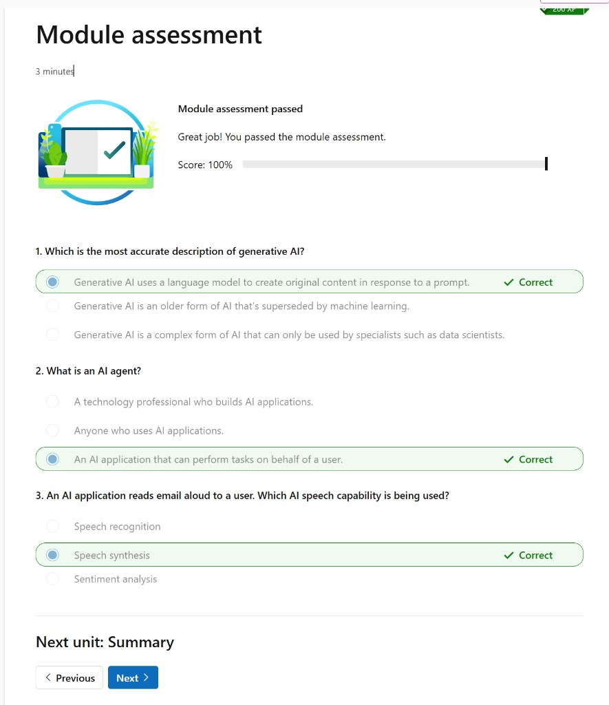

# Module assessment

The **Module assessment** unit is a short knowledge check at the end of this learning path. Completing it awards **200 XP**.

*Estimated time: 3 minutes*

When you pass, the page shows **Module assessment passed** and your score (for example **Score: 100%**). The next unit is **[Summary](10- Summary.md)**.

## Questions

### 1. Which is the most accurate description of generative AI?

- **Correct:** Generative AI uses a language model to create original content in response to a prompt.
- Generative AI is an older form of AI that's superseded by machine learning.
- Generative AI is a complex form of AI that can only be used by specialists such as data scientists.

### 2. What is an AI agent?

- A technology professional who builds AI applications.
- Anyone who uses AI applications.
- **Correct:** An AI application that can perform tasks on behalf of a user.

### 3. An AI application reads email aloud to a user. Which AI speech capability is being used?

- Speech recognition
- **Correct:** Speech synthesis
- Sentiment analysis
