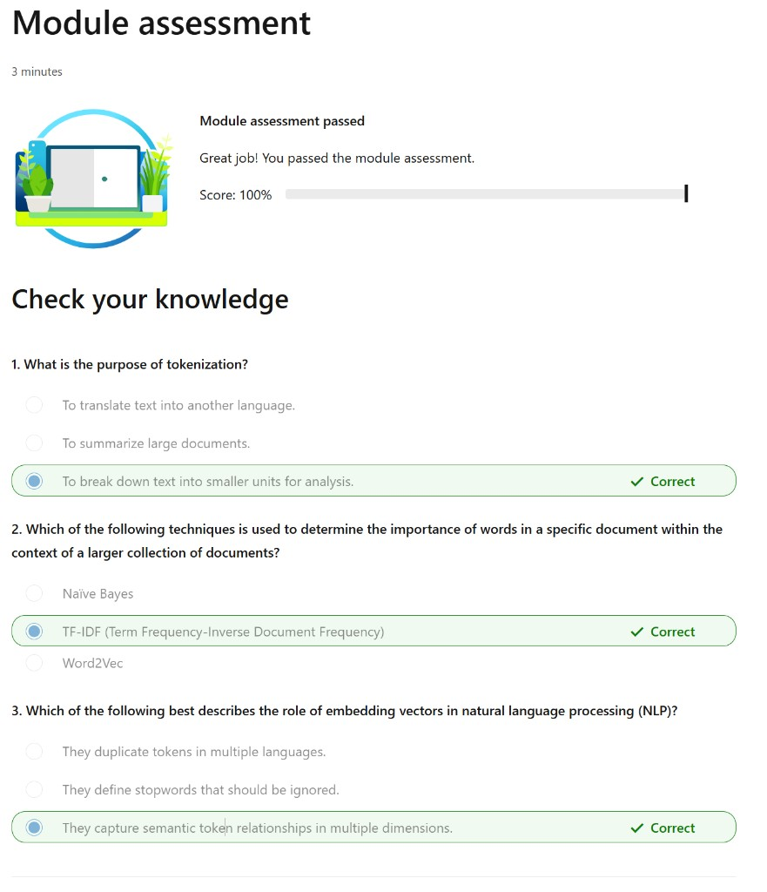

# Module assessment

The **Module assessment** unit is a short knowledge check at the end of this module. Completing it awards **200 XP**.

*Estimated time: 3 minutes*

When you pass, the page shows **Module assessment passed** and feedback such as **Great job! You passed the module assessment.** Your score appears as **Score: 100%** when you answer all items correctly.

## Questions

### 1. What is the purpose of tokenization?

- To translate text into another language.
- To summarize large documents.
- **Correct:** To break down text into smaller units for analysis.

### 2. Which of the following techniques is used to determine the importance of words in a specific document within the context of a larger collection of documents?

- Naïve Bayes
- **Correct:** TF-IDF (Term Frequency-Inverse Document Frequency)
- Word2Vec

### 3. Which of the following best describes the role of embedding vectors in natural language processing (NLP)?

- They duplicate tokens in multiple languages.
- They define stopwords that should be ignored.
- **Correct:** They capture semantic token relationships in multiple dimensions.
