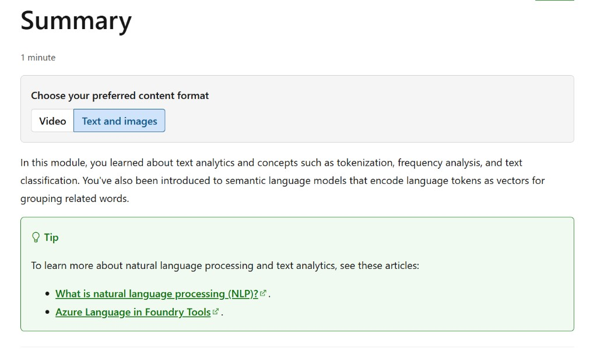

# Summary

**100 XP** · *Estimated time: 1 minute*

**Choose your preferred content format:** Video, or **Text and images** (the text version often includes more detail than the videos, so you can use it as supplemental material.)

In this module, you learned about text analytics and concepts such as tokenization, frequency analysis, and text classification. You've also been introduced to semantic language models that encode language tokens as vectors for grouping related words.

> **Tip:** To learn more about natural language processing and text analytics, see these articles:
>
> - [What is natural language processing (NLP)?](https://azure.microsoft.com/en-us/resources/cloud-computing-dictionary/what-is-natural-language-processing)
> - [Azure Language in Foundry Tools](https://learn.microsoft.com/en-us/azure/ai-services/language-service/)

---

## All units complete:
