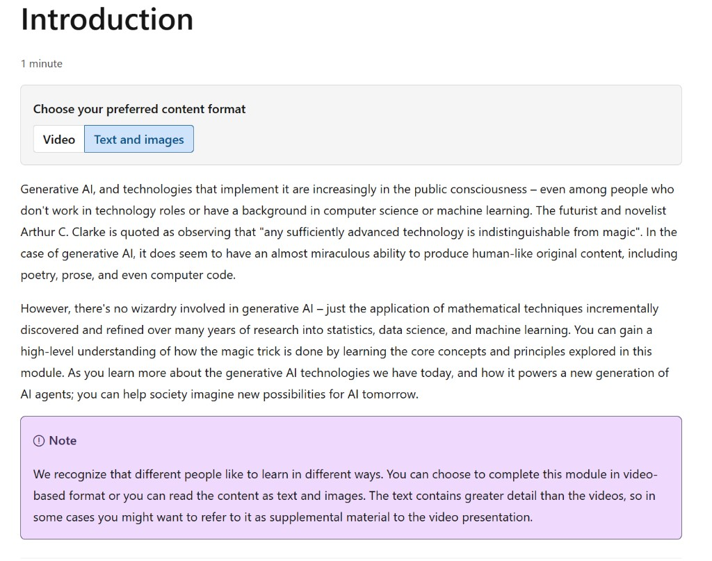

# Introduction

*1 minute*

**Choose your preferred content format**

- **Video** — video-based lesson
- **Text and images** — read on-screen text and figures (this option is highlighted in the module UI)

Generative AI, and technologies that implement it are increasingly in the public consciousness – even among people who don't work in technology roles or have a background in computer science or machine learning. The futurist and novelist Arthur C. Clarke is quoted as observing that "any sufficiently advanced technology is indistinguishable from magic". In the case of generative AI, it does seem to have an almost miraculous ability to produce human-like original content, including poetry, prose, and even computer code.

However, there's no wizardry involved in generative AI – just the application of mathematical techniques incrementally discovered and refined over many years of research into statistics, data science, and machine learning. You can gain a high-level understanding of how the magic trick is done by learning the core concepts and principles explored in this module. As you learn more about the generative AI technologies we have today, and how it powers a new generation of AI agents; you can help society imagine new possibilities for AI tomorrow.

> **Note**  
> We recognize that different people like to learn in different ways. You can choose to complete this module in video-based format or you can read the content as text and images. The text contains greater detail than the videos, so in some cases you might want to refer to it as supplemental material to the video presentation.
