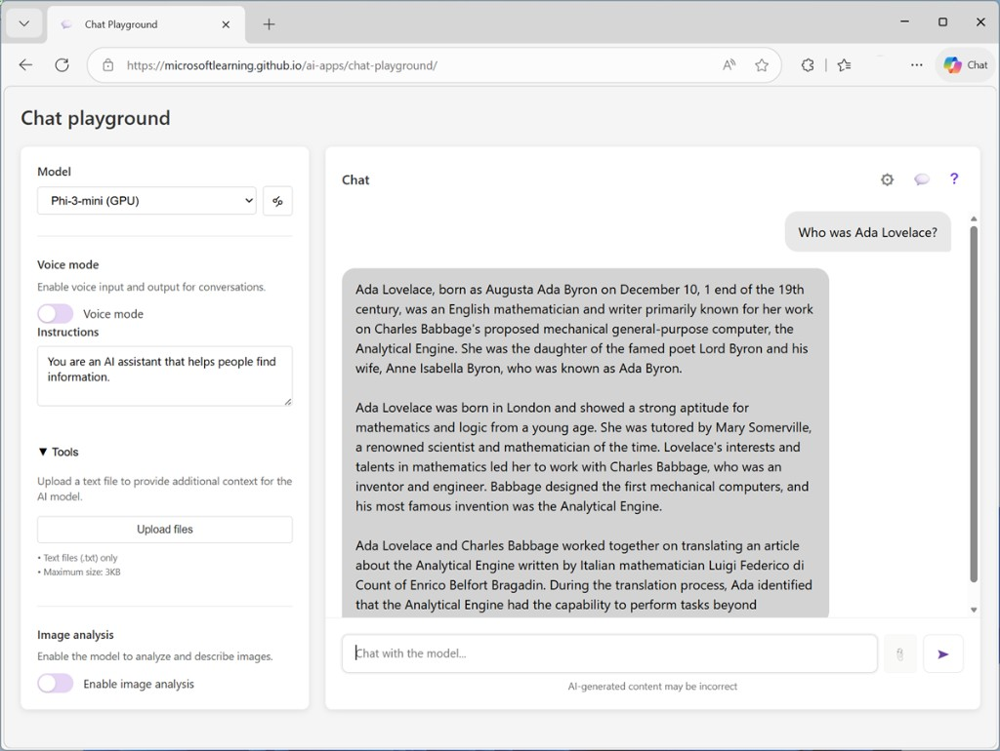
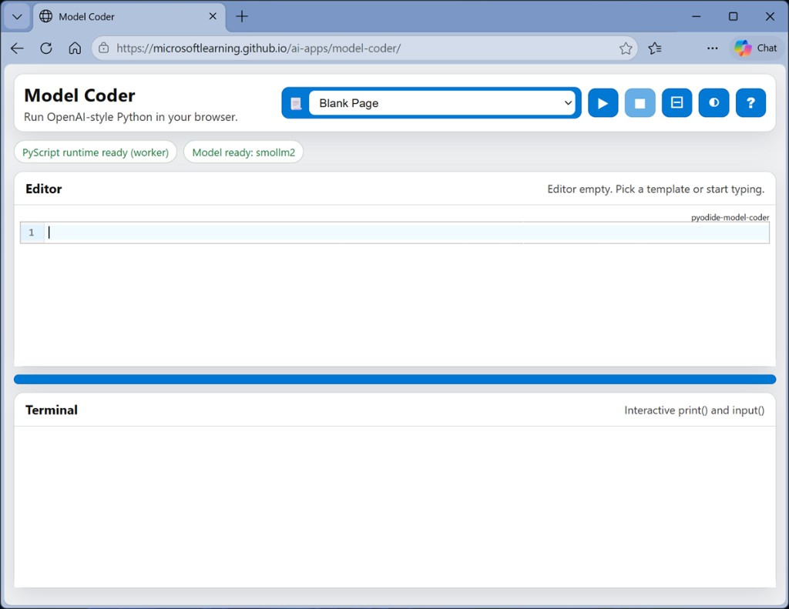

# Explore generative AI

*15 minutes*

In this exercise, you’ll use a chat playground to interact with a generative AI model. The goal of this exercise is to explore the effect of system prompts, model parameters, and grounding models with data.

To complete this lab, you need a modern browser on a computer with sufficient hardware resources to load and run the models used by the AI agent app. On older or low-spec computers, the app may run very slowly or experience errors.

### Minimum spec

- 64-bit CPU, 4+ physical cores (8 logical threads preferred)
- 8+ GB system RAM (16 GB recommended)
- Enough storage to cache ~300MB–800MB model assets
- Latest Chrome / Edge / Firefox with WASM SIMD enabled/available (WebGPU support is required for the default model; a WASM-based fallback is provided)

This exercise should take approximately **15 minutes** to complete.

## Chat with a model

Let’s start by using a chat interface to submit prompts to a generative AI model. In this exercise, we’ll use a small language model that is useful for general chat solutions in low bandwidth scenarios.

> **Note:** If your browser supports WebGPU, the chat playground uses the *Microsoft Phi 3 Mini* model running on your computer’s GPU. If not, the **SmolLM2** model is used, running on CPU—with reduced response-generation quality. Performance for either model may vary depending on the available memory in your computer and your network bandwidth to download the model. On older or low-spec devices, you may get more reliable behavior by switching to the CPU-based model even if WebGPU is available. After opening the app, use the **?** (*About this app*) icon in the chat area to find out more.

1. In a web browser, open the [Chat Playground](https://aka.ms/chat-playground).
2. Wait for the model to download and initialize.

> **Tip:** The first time you download a model, it may take a few minutes. Subsequent downloads will be faster. If your browser or operating system does not support WebGPU models, the fallback CPU-based model will be selected (which provides slower performance and reduced quality of response generations).

3. When the model is ready, enter a prompt such as *Who was Ada Lovelace?*, and review the response (which may take some time to be generated).



4. Enter a follow-up prompt, such as *Tell me more about her work with Charles Babbage.*, and review the response.

> **Note:** Generative AI chat applications often include chat history in the prompt; so the context of the conversation is retained between messages (for example, in the follow-up prompt *Tell me more about her work with Charles Babbage.*, “her” is interpreted as relating to Ada Lovelace).

5. At the top of the chat pane, use the **New chat** (💬) button to restart the conversation. This removes all conversation history.
6. Enter a new prompt, such as *Who was Alan Turing?* and view the response.
7. Continue the conversation with prompts such as *What is the Turing test?* or *What is a Turing machine?*

## Experiment with system prompts

A system prompt is used to provide the model with an overall context for its responses. You can use the system prompt to provide guidelines about format, style, and constraints about what the model should and should not include in its responses.

1. At the top of the chat pane, use the **New chat** (💬) button to restart the conversation. Then enter a new prompt, such as *What was ENIAC?* and view the response.
2. Start a new chat, and then in the pane on the left, in the **Instructions** text area, change the system prompt to:

   ```text
   You are an AI assistant that helps people find information about computing history. IMPORTANT:
   You must answer concisely with a single paragraph.
   ```

3. Now try the same prompt as before (*What was ENIAC?*) and review the output.
4. Continue to experiment with different system prompts to try to influence the kinds of response returned by the model.

> **Note:** Smaller models like SmolLM2 can be less responsive to explicit system prompts than larger ones. You may observe some cases where the system instructions are not followed precisely.

5. When you have finished experimenting, change the system prompt back to:

   ```text
   You are an AI assistant that helps people find information.
   ```

## Experiment with model parameters

Model parameters control how the model works, and can be useful for restricting the size of its responses (measured in tokens) and controlling how “creative” its responses can be.

1. Use the **New chat** (💬) button to restart the conversation.
2. In the pane on the left, next to the selected model, select **Parameters** (🝰).
3. Review the parameter settings; then, without changing them, enter a prompt like *Explain Moore's law.* and review the response.
4. Experiment by changing the parameter values and repeating the same prompt. You should see some differences in behavior from the model. For example, changing the **Temperature** modifies the randomness of the model’s word selection, changing the “creativity” of the responses (to the point that too high a temperature can cause nonsensical responses).

> **Note:** Parameter changes can have less effect on smaller models.

5. When you’ve finished experimenting, reset the parameters to their default values.

## Ground responses with data

Generative AI is the foundation for agentic solutions; in which AI agents can assist you and act on your behalf. Agents are more than general purpose chat apps. They usually have a particular focus, and use knowledge and tools to perform their duties.

For example, let’s suppose an organization wants to use a generative AI agent to help employees with expense claims.

1. Change the system prompt to *You are a helpful AI assistant who supports employees with expense claims.* and start a new chat conversation.
2. Enter the prompt *How do I submit a claim?* and view the response.

The response is likely to be generic. Accurate; but not particularly helpful to the employee. We need to give the agent some knowledge about the company’s expense policies and procedures.

3. Open a new browser tab, and view the expenses guide at [https://aka.ms/expenses-txt](https://aka.ms/expenses-txt). We’ll use this to ground the model, so it has some context for questions about expenses.

> **Note:** This is a very small document for the purposes of this exercise. In a real scenario, an AI agent might have access to large volumes of data; usually in the form of a vector index.

4. Save the `expenses.txt` file on your local computer.
5. Return to the tab containing the chat playground, and in the pane on the left, expand the **Tools** section if it’s not already expanded.
6. Upload the `expenses.txt` file. The chat is automatically restarted.
7. Enter the same expenses-related prompt (*How do I submit a claim?*) and view the response.

This time the response should be informed by the information in the expenses data source.

8. Try a few more expenses-related prompts, like *How much can I spend on a taxi?*, *What about a hotel?* or *Can I claim the cost of my dinner?*

> **Note:** The small amount of data and the limited capabilities of the small models used in this exercise may result in some inaccurate responses; but the principle of retrieving contextual information, using it to augment the prompt, and generating responses based on the data is a common pattern in generative AI solutions known as Retrieval Augmented Generation (or RAG).

## Explore client code

You’ve seen how models and agents can be used in a pre-provided chat playground, but how do developers build apps and agents that submit prompts to models and process responses?

One of the most commonly used application programming interfaces (APIs) used to develop apps that work with LLMs is the OpenAI API—and in particular the Python SDK for the OpenAI API.

1. Navigate away from the Chat Playground app to the [Model Coder](https://aka.ms/model-coder) app and wait for the Python environment and model to load.

> **Note:** As with the chat playground, the first time the model is loaded it may take a minute or so. If your browser supports WebGPU, the Microsoft Phi 3-mini model will be loaded using the WebLLM engine. Otherwise, the SmolLM2 model will be used in wllama, running in CPU mode.



This app provides an in-browser sandbox with a Python library that encapsulates the most common classes in the OpenAI SDK. You’ll use it to write and run real Python code that submits prompts to a local LLM running in the browser.

2. When the model has loaded, ensure the **Blank Page** sample is selected and that there is no existing code in the **Editor** pane. Then add the following code to implement a simple AI agent that can help you categorize expenses:

```python
# import namespace
from openai import OpenAI

def main():

    try:
        # Configuration settings
        endpoint = "https://local/openai"
        key = "key123"
        model_name = "local-llm"

        # Initialize the OpenAI client
        openai_client = OpenAI(
            base_url=endpoint,
            api_key=key
        )

        # Get a response to a prompt
        input_text = input('\nAgent: Enter a question about expense categories.\nYou: ')
        response = openai_client.responses.create(
            model=model_name,
            instructions="""
                      You are a helpful AI agent that assists employees with expense claim categorization.
                      Always apply the following category recommendations:
                      - 'Transportation' for taxis, rideshares, trains, buses, and flights.
                      - 'Meals' for food and drinks including breakfast, lunch, and dinner.
                      - 'Accommodation' for hotels, motels, and other lodging.
                      - 'Miscellaneous' for anything else.
                    """,
            input=input_text
        )
        print(f"Agent: {response.output_text}")

    except Exception as ex:
        print(ex)

if __name__ == '__main__':
    main()
```

This code uses the OpenAI Responses API, which is commonly used to submit prompts to models and agents.

3. Use the ▶ (**Run code**) button on the toolbar to run the Python code.

The code runs in the **Terminal** pane at the bottom of the screen (it may take a minute or so to run).

4. When prompted, enter a question about expense categories; such as:

```text
What category is a taxi ride?
```

5. Wait for the response, and then review the answer that was returned.

You can re-run the code and try alternative prompts, such as *What expense category should I use for a hotel room?*

> **Note:** The model used in this app is a small language model with limited training data and a small context window. Responses may not be accurate—particularly when using the SmolLM2 model in CPU mode. However, the point of the exercise is to explore the OpenAI SDK syntax to submit prompts and receive responses—regardless of how inaccurate they may be!

## Summary

In this exercise, you explored a generative AI model in a chat playground. You’ve seen how a model’s responses can be affected by changing the system prompt, configuring model parameters, and by adding data. Finally, you’ve explored how developers can build generative AI client applications through OpenAI-compatible APIs in Python.

The interface and techniques used in this exercise are similar to those in **Microsoft Foundry portal**; a platform for building AI apps and agents in the Microsoft Azure cloud. You can use the OpenAI SDK to connect to Microsoft Foundry endpoints and work with your models and agents there.
