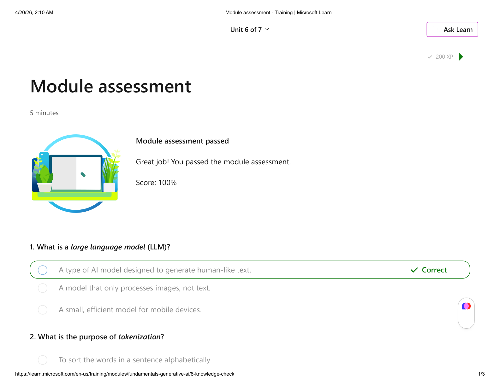

# Module assessment

The **Module assessment** unit is a short knowledge check at the end of this module. Completing it awards **200 XP**.

*Estimated time: 5 minutes*

When you pass, the page shows **Module assessment passed** and feedback such as **Great job! You passed the module assessment.** Your score appears as **Score: 100%** when you answer all items correctly. The next unit is **[Summary](6- Summary.md)**.

## Questions

### 1. What is a large language model (LLM)?

- **Correct:** A type of AI model designed to generate human-like text.
- A model that only processes images, not text.
- A small, efficient model for mobile devices.

### 2. What is the purpose of tokenization?

- To sort the words in a sentence alphabetically
- **Correct:** To break down text into smaller units.
- To convert text into binary code for processing by computers.

### 3. What are embeddings?

- Extra words added by a transformer model to enhance text generation.
- Small language models used for specific tasks.
- **Correct:** Vector-based representations of tokens that capture their semantic meaning.

### 4. What does an attention layer do in a transformer model?

- Removes irrelevant words from the input text.
- **Correct:** Examines the relationships between each token and the tokens around it.
- Flags inappropriate content in the generated text.

### 5. What is the purpose of a system prompt?

- **Correct:** To provide context and instructions to the AI model.
- To configure a generative AI model to run on a particular operating system.
- To store user preferences for future interactions.

### 6. What is an agent in the context of AI?

- **Correct:** An AI system that can perform tasks on behalf of a user.
- A generative AI model that operates in secret.
- A human operator to whom generative AI models escalate requests they can't handle.
