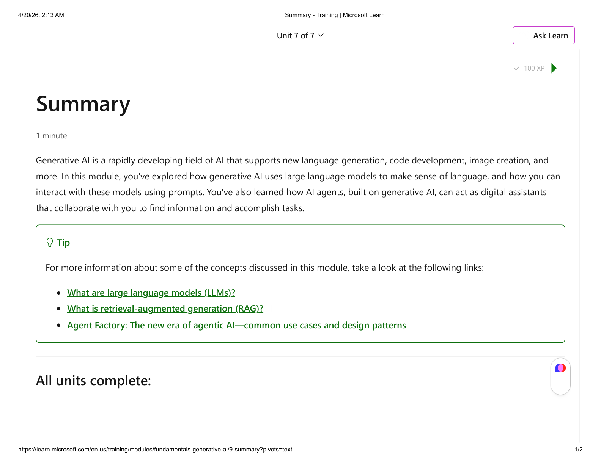

# Summary

**100 XP** · *Estimated time: 1 minute*

**Choose your preferred content format**

- **Video** — video-based lesson
- **Text and images** — read on-screen text and figures (this option is highlighted in the module UI)

Generative AI is a rapidly developing field of AI that supports new language generation, code development, image creation, and more. In this module, you've explored how generative AI uses large language models to make sense of language, and how you can interact with these models using prompts. You've also learned how AI agents, built on generative AI, can act as digital assistants that collaborate with you to find information and accomplish tasks.

> **Tip:** For more information about some of the concepts discussed in this module, take a look at the following links:
>
> - [What are large language models (LLMs)?](https://azure.microsoft.com/resources/cloud-computing-dictionary/what-are-large-language-models-llms)
> - [What is retrieval-augmented generation (RAG)?](https://azure.microsoft.com/resources/cloud-computing-dictionary/what-is-retrieval-augmented-generation-rag)
> - [Agent Factory: The new era of agentic AI—common use cases and design patterns](https://azure.microsoft.com/blog/agent-factory-the-new-era-of-agentic-ai-common-use-cases-and-design-patterns)

---

## All units complete:
