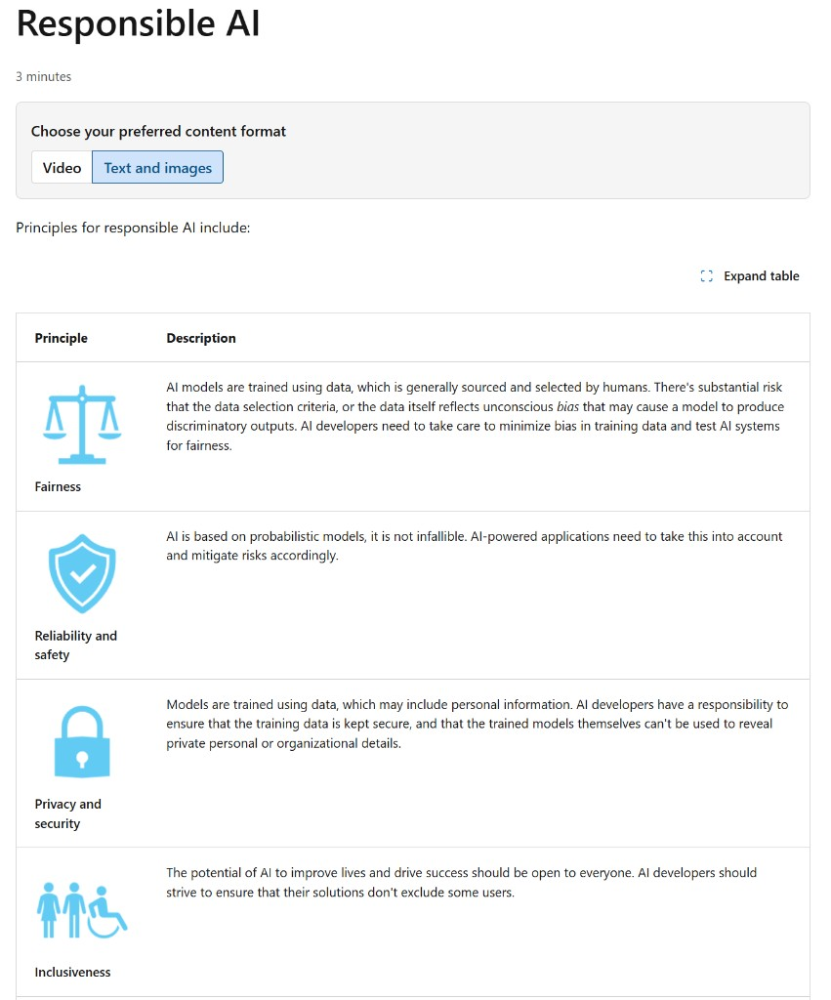
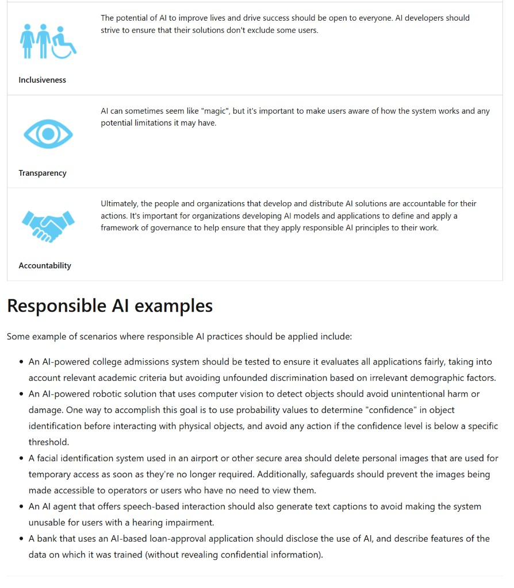

# Responsible AI

*Estimated reading time: 3 minutes*

Principles for responsible AI include:

<!-- Retained for reference (not shown in preview):

-->

| Principle | Description |
| --- | --- |
|  **Fairness** | AI models are trained using data, which is generally sourced and selected by humans. There's substantial risk that the data selection criteria, or the data itself reflects unconscious *bias* that may cause a model to produce discriminatory outputs. AI developers need to take care to minimize bias in training data and test AI systems for fairness. |
|  **Reliability and safety** | AI is based on probabilistic models, it is not infallible. AI-powered applications need to take this into account and mitigate risks accordingly. |
|  **Privacy and security** | Models are trained using data, which may include personal information. AI developers have a responsibility to ensure that the training data is kept secure, and that the trained models themselves can't be used to reveal private personal or organizational details. |
|  **Inclusiveness** | The potential of AI to improve lives and drive success should be open to everyone. AI developers should strive to ensure that their solutions don't exclude some users. |
|  **Transparency** | AI can sometimes seem like "magic", but it's important to make users aware of how the system works and any potential limitations it may have. |
|  **Accountability** | Ultimately, the people and organizations that develop and distribute AI solutions are accountable for their actions. It's important for organizations developing AI models and applications to define and apply a framework of governance to help ensure that they apply responsible AI principles to their work. |

<!-- 
-->

## Responsible AI examples

Some example of scenarios where responsible AI practices should be applied include:

- **College admissions:** An AI-powered college admissions system should be tested to ensure it evaluates all applications fairly, taking into account relevant academic criteria but avoiding unfounded discrimination based on irrelevant demographic factors.
- **Robotics and computer vision:** An AI-powered robotic solution that uses computer vision to detect objects should avoid unintentional harm or damage. One way to accomplish this goal is to use probability values to determine "confidence" in object identification before interacting with physical objects, and avoid any action if the confidence level is below a specific threshold.
- **Facial identification and privacy:** A facial identification system used in an airport or other secure area should delete personal images that are used for temporary access as soon as they're no longer required. Additionally, safeguards should prevent the images being made accessible to operators or users who have no need to view them.
- **Speech-based AI accessibility:** An AI agent that offers speech-based interaction should also generate text captions to avoid making the system unusable for users with a hearing impairment.
- **Financial disclosures:** A bank that uses an AI-based loan-approval application should disclose the use of AI, and describe features of the data on which it was trained (without revealing confidential information).
