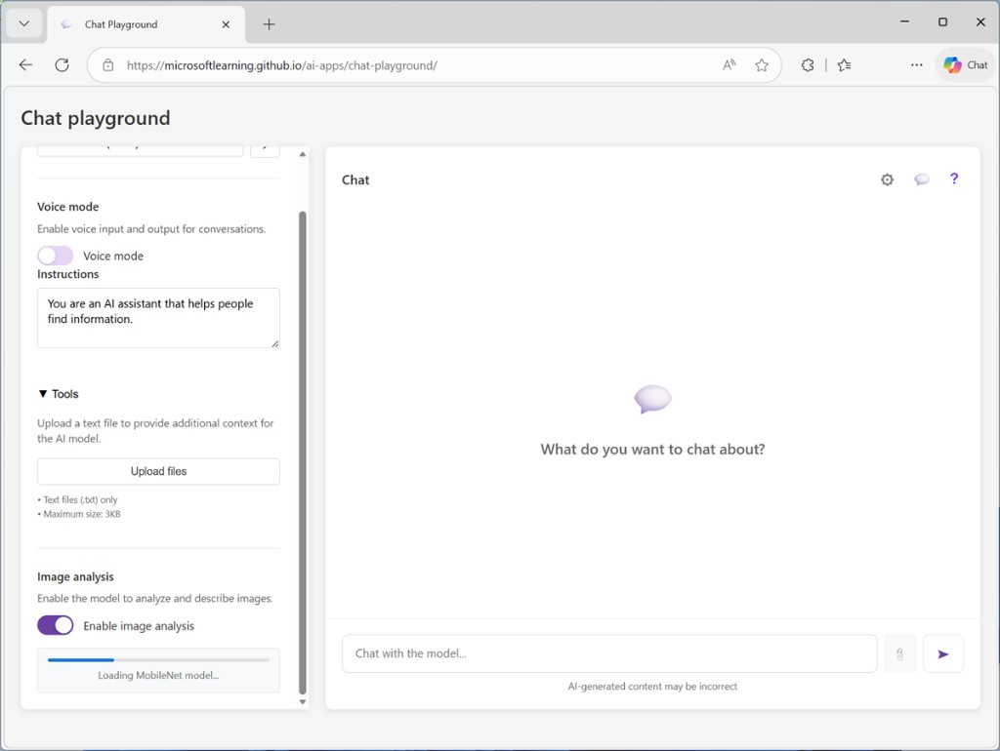
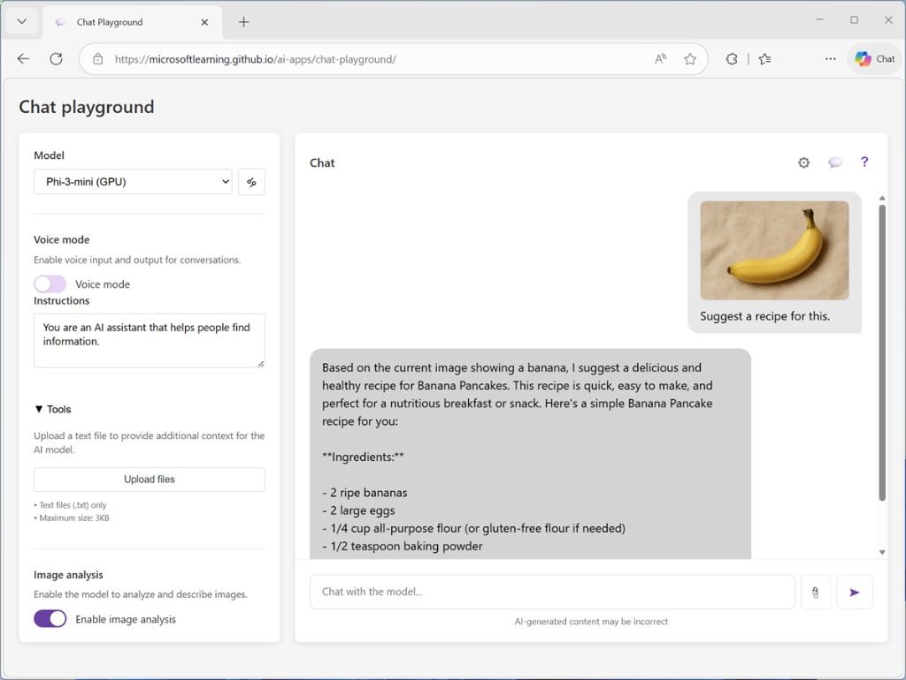

# Explore computer vision

*15 minutes*

In this exercise, you’ll use a chat playground to interact with a generative AI solution that can analyze and interpret images. The goal of this exercise is to explore a common pattern for combining text and visual input in a prompt for a generative AI model.

To complete this lab, you need a modern browser on a computer with sufficient hardware resources to load and run the models used by the AI agent app. On older or low-spec computers, the app may run very slowly or experience errors.

### Minimum spec

- 64-bit CPU, 4+ physical cores (8 logical threads preferred)
- 8+ GB system RAM (16 GB recommended)
- Enough storage to cache ~300MB–800MB model assets
- Latest Chrome / Edge / Firefox with WASM SIMD enabled/available (WebGPU support is required for the default model; a WASM-based fallback is provided)

This exercise should take approximately **15 minutes** to complete.

## Prepare for image-based chat

In this exercise you use a generative AI model in a chat playground to respond to prompts that include image data.

> **Note:** The chat application uses a small language model to interpret and respond to prompts. If WebGPU is supported in your browser, the Microsoft Phi 3 mini model is run on your computer’s GPU; if not, the SmolLM2 model is run on the CPU. On older or low-spec devices, you may get more reliable behavior by switching to the CPU-based model even if WebGPU is available. Many modern large language models are multimodal—in other words, they support multiple formats of input, including text and images. However, the Microsoft Phi 3 mini and SmolLM2 models are text-based only, so we’ll also use the MobileNetV3 CNN-based computer vision model for image classification and include the predicted image class in the prompt.

1. In a web browser, open the [Chat Playground](https://aka.ms/chat-playground).

The app initializes by downloading a language model.

> **Tip:** The first time you download a model, it may take a few minutes. Subsequent downloads will be faster. If your browser or operating system does not support WebGPU models, the fallback CPU-based model will be selected (which provides slower performance and reduced quality of response generations).

2. While waiting for the model to download, open a new browser tab, and download **images.zip** from [https://aka.ms/ai-images](https://aka.ms/ai-images) to your local computer.

3. Extract the downloaded archive in a local folder to see the files it contains. These files are the images you will use AI to analyze.

4. Return to the browser tab containing the chat playground and ensure a language model has downloaded. Then, in the configuration pane on the left, in the **Vision** section, enable **Image analysis** and wait for the computer vision model to be downloaded and initialized.

In the chat interface, an **Upload image** (📎) button is enabled.

5. Click the **Upload image** button, and browse to select one of the images you extracted on your computer.

A thumbnail of the image is added to the prompt input area.

6. Enter a prompt like **Suggest a recipe for this.** The image is included in the message.

The MobileNetV3 model is used to determine the likely subject of the image, and the results of that analysis are included in the prompt to the Phi language model. The result should be a response that uses the image information to answer the question.

7. Submit prompts that include the other images, such as **How should I cook this?** or **What desserts could I make with this?**

> **Note:** Responses from the SmolLM2 model running on CPU may not be as useful as responses from the Microsoft Phi 3 mini model running on GPU!

8. If you want to explore further, you can upload your own images and enter appropriate prompts. The combination of a small language model and a limited computer vision model means that the quality of the responses may be highly variable compared to a true multimodal large language model!

## Summary

In this exercise, you explored the use of computer vision with a generative AI model in a chat playground.

The app used in this exercise is based on a simplified version of the chat playground in the Microsoft Foundry portal. Microsoft Foundry supports a range of multimodal models that can accept combined image and text input, enabling significantly more complex image interpretation than this simple example. Additionally, you can use the Azure Content Understanding tool to analyze images.
