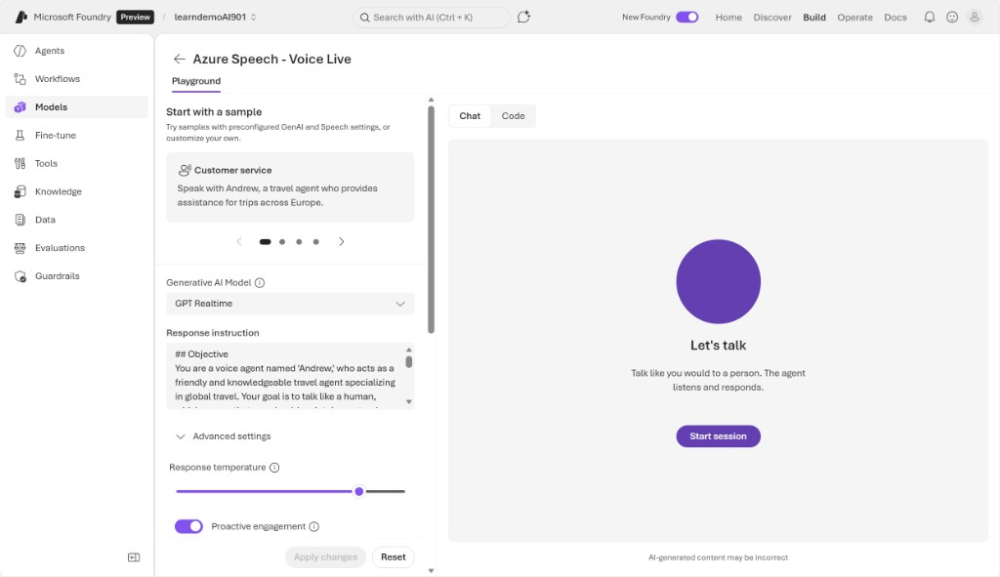
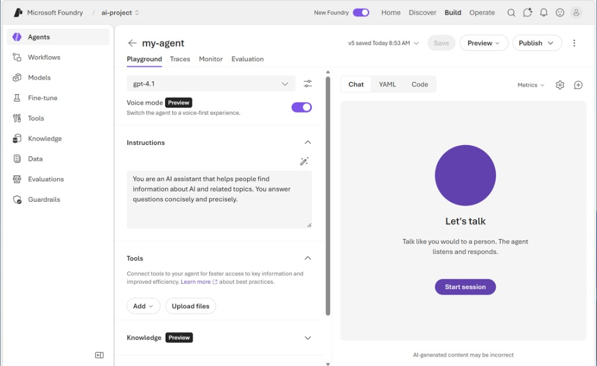
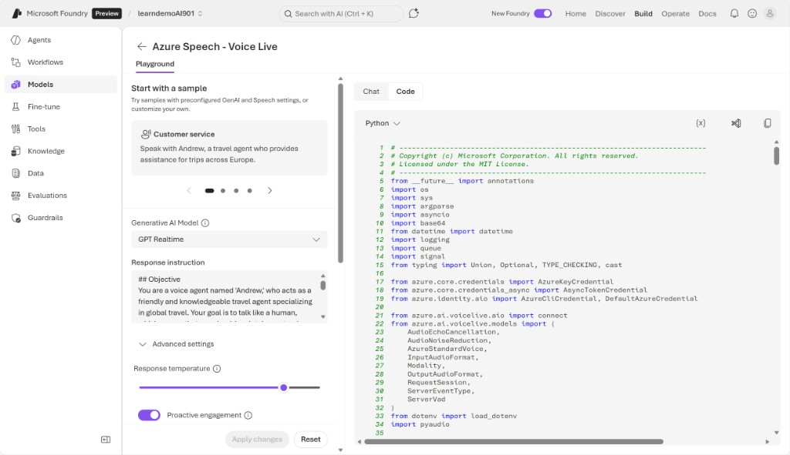
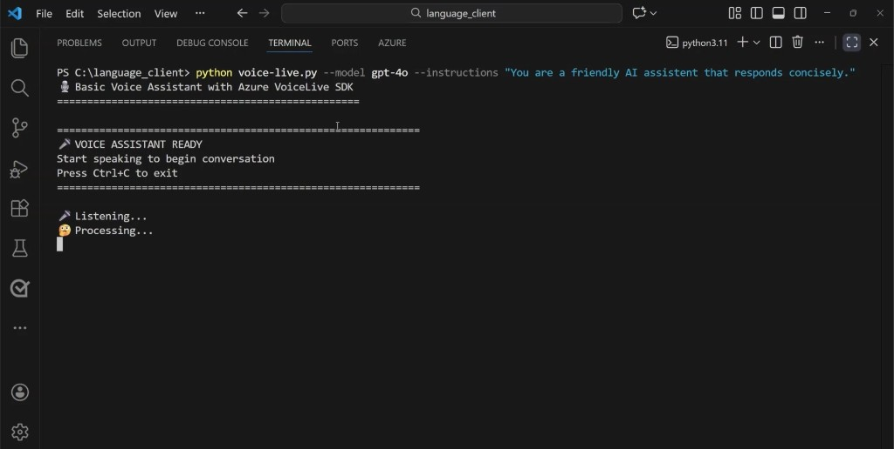

# Creating a speech-capable agent

*4 minutes* • *100 XP*

*Training PDF (browser export):* [4- Creating a speech-capable agent - Training _ Microsoft Learn.pdf](./4- Creating a speech-capable agent - Training _ Microsoft Learn.pdf)

AI agents are software programs that can understand information, make decisions, and take actions on their own to help users achieve specific goals. A common goal for AI agents is to be able to conduct real-time spoken conversations just like you would with a human.

Speech-to-speech is a capability that lets an application take spoken audio as input and produce spoken audio as output, without requiring the user to read or type text. The user experience feels like a natural voice conversation.

Speech-to-speech enables systems to:

- Listen to a person speaking
- Understand or transform what was said
- Respond with synthetic speech

Speech-to-speech combines speech-to-text and text-to-speech into a single conversational experience. Speech-to-speech is built as a pipeline of speech and language capabilities. The pipeline completes:

1. **Speech-to-Text:** Converting the user's spoken audio into text.
2. **Processing or reasoning:** Analyzing, translating, and summarizing the text, or used by an AI agent to decide what to say next.
3. **Text-to-Speech:** Converting the response text back into spoken audio.

Common speech-to-speech scenarios include:

- **Voice assistants and AI agents:** Users talk to an agent and hear spoken responses.
- **Speech translation:** A user speaks in one language and hears the response in another language.
- **Hands-free applications:** Navigation systems, kiosks, or industrial tools where typing isn't practical.
- **Accessibility:** Voice-based interaction for users who prefer or require audio input and output.
- **Customer support bots:** Callers speak naturally and receive spoken answers.

## Azure Speech - Voice Live

Azure Speech includes a VoiceLive Service which makes it easier to build conversational agents. The Voice Live API lets applications have real-time voice conversations. It allows a voice agent to listen to someone speaking and respond with spoken audio quickly and naturally.

Instead of building and connecting many separate pieces—like speech-to-text, AI reasoning, and text-to-speech—the Voice Live API combines everything into one service. The Voice Live API makes it easier and faster for developers to create voice-based experiences.

Azure fully manages VoiceLive, which means you don't need to set up or maintain the backend systems yourself. When you send audio into VoiceLive, it sends back spoken responses. VoiceLive can also return visuals, such as avatars, and trigger actions when needed. Azure handles the models and infrastructure behind the scenes, so you can focus on building the voice experience.

Azure speech-to-speech solutions utilize:

- **Azure Speech** which provides the speech-to-text and text-to-speech capabilities.
- **Agents or application logic** which makes decisions on responses.
- **Foundry Tools or MCP servers** which can expose speech as callable tools so agents don't manage SDKs or APIs directly.

You can explore Voice Live in a playground in Foundry portal. The Foundry playground includes some preconfigured voice samples that you can try out, or you can create a new solution of your own. When you create a solution, importantly, you need to choose a generative AI model for your agent to use. Azure Speech Voice Live uses the generative AI model alongside its own acoustic models to have a live conversation with the user. You can configure many settings in the playground. For example, you can enable proactive engagement, so the agent can initiate conversations.



You can also enable Voice mode for a Microsoft Foundry agent in the playground, which integrates Azure Speech Voice Live into the agent definition. This approach means that speech configuration is encapsulated in the agent itself, reducing the client code required to use it.



## Using Voice Live in an application

To develop a custom app that uses the agent, we need to write some code. To create an application in Python, you need the `azure-ai-voicelive` package.

The package can be installed in the Visual Studio Code terminal using:

```bash
pip install azure-ai-voicelive
```

> **Note**  
> You also need to install `pyaudio`, `python-dotenv`, and `azure-identity` in order to run your Voice Live application.

You can find sample code for a speech-to-speech application in the Foundry portal. The sample code handles all of the logic needed to initiate the session, connect to audio devices like mics and speakers, process the incoming and outgoing streams of audio, handle interruptions, and so on. The sample code is a good starting point for building your own application.



You can take the sample code into your own code editor and install the proper packages. When you run the application, a real-time voice assistant streams your microphone audio to Azure Voice Live, receives the assistant's spoken audio response back, and plays it through your speakers.



Voice Live in Azure Speech offers an effective way to build speech-capable conversational agents that engage naturally with users. Next, try out Azure Speech - Voice Live in Foundry yourself.

*Next unit: Exercise - Get started with speech in Microsoft Foundry*
