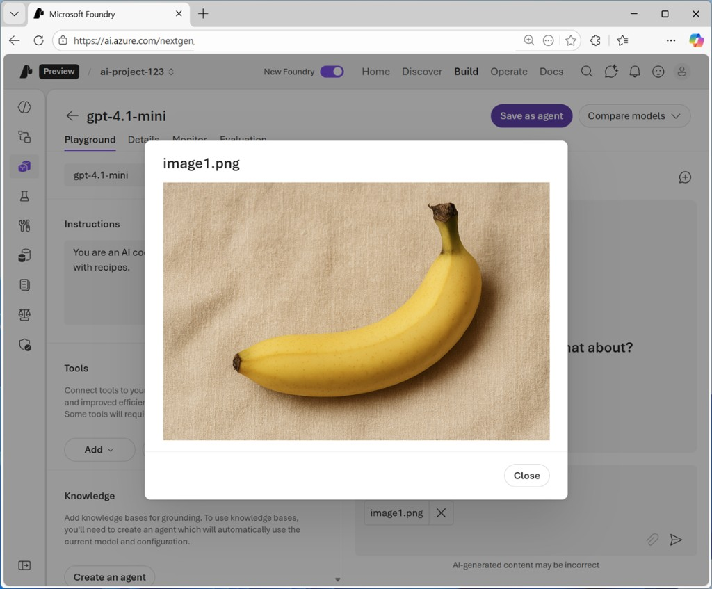
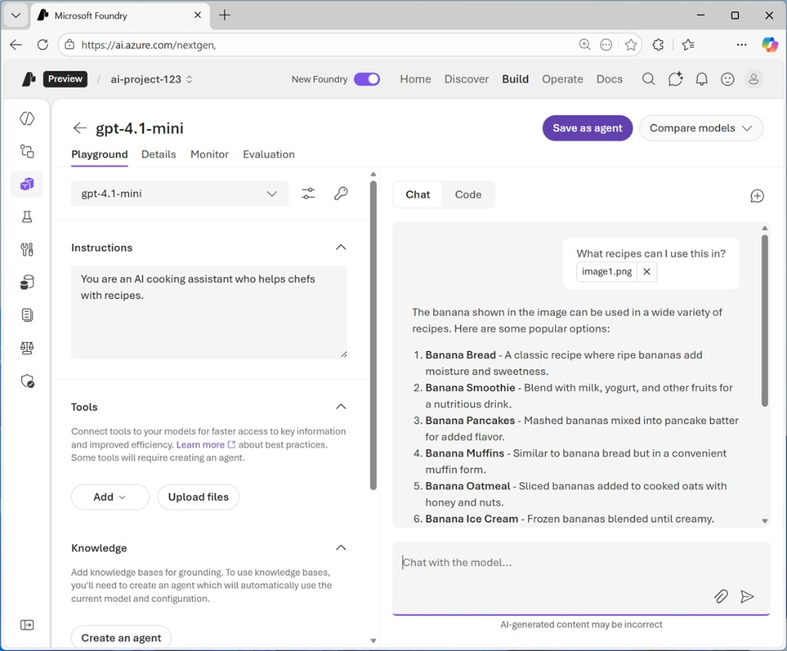
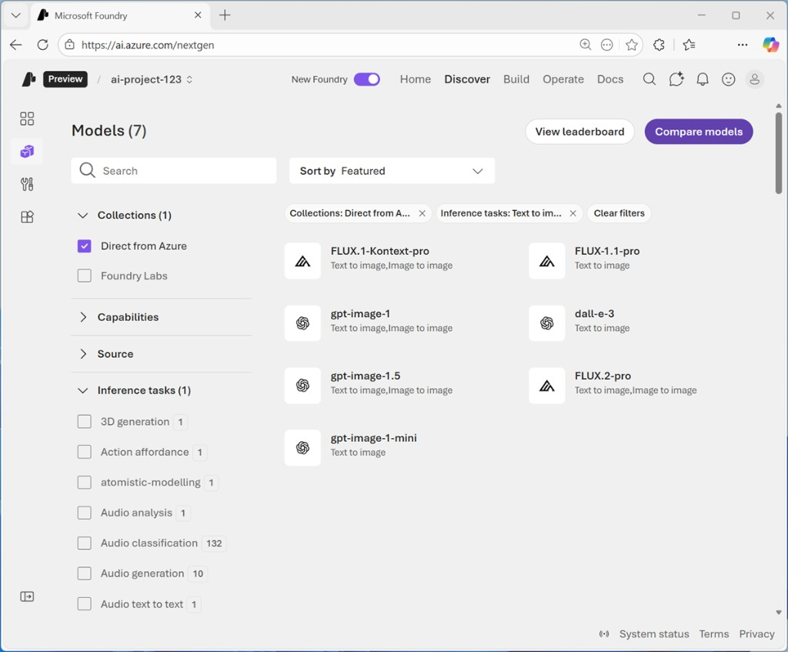
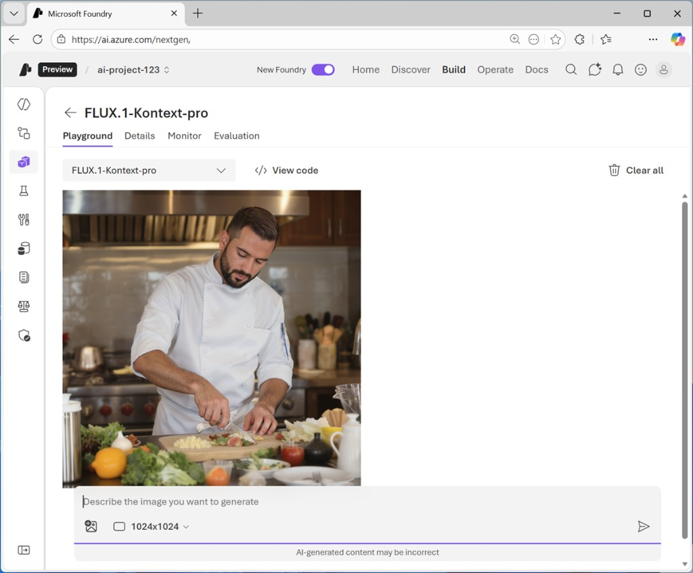
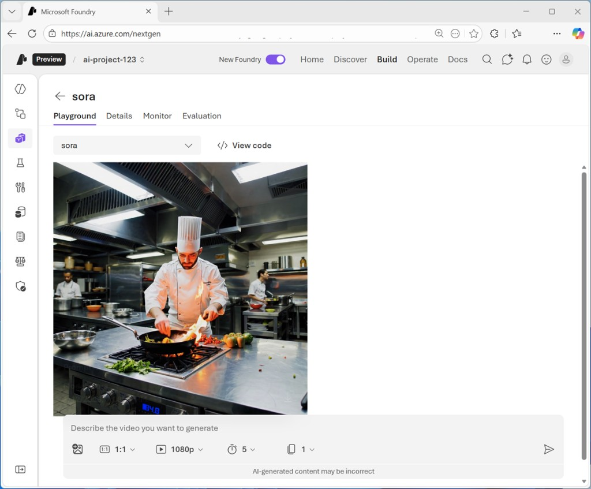

# Get started with computer vision in Microsoft Foundry

In this exercise, you'll use generative AI models in Microsoft Foundry to work with visual data.

*This exercise should take approximately 30 minutes to complete.*

*Training PDF (browser export):* [5- Get started with computer vision in Microsoft Foundry _ Get started with AI apps and agents in Azure.pdf](./5- Get started with computer vision in Microsoft Foundry _ Get started with AI apps and agents in Azure.pdf)

## Create a Microsoft Foundry project

Microsoft Foundry uses projects to organize models, resources, data, and other assets used to develop an AI solution.

1. In a web browser, open Microsoft Foundry at [https://ai.azure.com](https://ai.azure.com) and sign in using your Azure credentials. Close any tips or quick start panes that are opened the first time you sign in, and if necessary use the Foundry logo at the top left to navigate to the home page.
2. If it is not already enabled, in the toolbar at the top of the page, enable the **New Foundry** option. Then, if prompted, create a new project with a unique name; expanding the **Advanced options** area to specify the following settings for your project:
   - **Foundry resource:** Enter a valid name for your AI Foundry resource.
   - **Subscription:** Your Azure subscription.
   - **Resource group:** Create or select a resource group.
   - **Region:** Select any of the AI Foundry recommended regions.
3. Wait for your project to be created. It may take a few minutes. After creating or selecting a project in the new Foundry portal, it should open in a page similar to the following image:


## Use a generative AI model to analyze images

Computer vision models enable AI systems to interpret image-based data, such as photographs, videos, and other visual elements. In this exercise, you'll explore how the developer of an AI agent to help aspiring chefs could use a vision-enabled model to interpret images of ingredients and suggest relevant recipes.

1. In a new browser tab, download [images.zip](https://microsoftlearning.github.io/mslearn-ai-fundamentals/data/images.zip) to your local computer.
2. Extract the downloaded archive in a local folder to see the files it contains. These files are the images you will use AI to analyze.
3. Return to the browser tab containing your Microsoft Foundry project.
4. Select **Start building**, then select **Find models** (or on the **Discover** page, select the **Models** tab) to view the Microsoft Foundry model catalog.
5. Search for and deploy the `gpt-4.1-mini` model using the default settings. Deployment may take a minute or so.

> **Tip**
> Model deployments are subject to regional quotas. If you don't have enough quota to deploy the model in your project's region, you can use a different model such as `gpt-4.1` or `gpt-4o`. Alternatively, you can create a new project in a different region.

6. When the model has been deployed, view the model playground page that opens, in which you can chat with the model.


7. Use the button at the bottom of the left navigation pane to hide it and give yourself more room to work.
8. In the pane on the left, set the **Instructions** to:

```text
You are an AI cooking assistant who helps chefs with recipes.
```

9. In the chat pane, use the **Upload image** button to select one of the images you extracted on your computer. The image is added to the prompt area.

You can select the image you have added to view it.



10. Enter prompt text like `What recipes can I use this in?` and submit the prompt, which contains both the uploaded image and the text.
11. Review the response, which should include relevant recipe suggestions for the image you uploaded.



> **Note**
> If the error `ERR_BAD_REQUEST: The provided data does not match the expected schema` is returned, try switching to the Classic portal by de-selecting the **New Foundry** option. In the classic portal, open the Chat playground in the Playgrounds page.

12. Submit prompts that include the other images, such as `How should I cook this?` or `What desserts could I make with this?`

## View code

To develop a client app or agent that can use the model to interpret images, you can use the OpenAI Responses API.

1. In the **Chat** pane, select the **Code** tab to view sample code.
2. Select the following code options:
   - **API:** Responses API
   - **Language:** Python
   - **SDK:** OpenAI SDK
   - **Authentication:** Key authentication

The default sample code includes only a text-based prompt. To submit a prompt that analyzes an image, you can modify the `input` parameter to include both text and image content, as shown here:

```python
from openai import OpenAI

endpoint = "https://your-project-resource.openai.azure.com/openai/v1/"
deployment_name = "gpt-4.1-mini"
api_key = "<your-api-key>"

client = OpenAI(
    base_url=endpoint,
    api_key=api_key
)

response = client.responses.create(
    model=deployment_name,
    input=[{
        "role": "user",
        "content": [
            {"type": "input_text", "text": "what's in this image?"},
            {"type": "input_image", "image_url": "https://an-online-image.jpg"},
        ],
    }],
)

print(f"answer: {response.output[0]}")
```

> **Tip**
> If you are using a work or school account to sign into Azure, and you have sufficient permissions in the Azure subscription, you can open the sample code in VS Code for Web to experiment with image-based input content. You can obtain the key for your service in the **Code** tab of the model playground (above the sample code) and you can use the image `orange.jpg` at [https://microsoftlearning.github.io/mslearn-ai-fundamentals/data/orange.jpg](https://microsoftlearning.github.io/mslearn-ai-fundamentals/data/orange.jpg). To learn more about using the OpenAI API to analyze images, see the OpenAI documentation.

## Use a generative AI model to create new images

So far you've explored the ability of a generative AI model to process visual input. Now let's suppose we want some appropriate images on a website to support the AI chef agent. Let's see how a model can generate visual output.

> **Note**
> This task requires a subscription that has access to image-generation models.

1. Use the back arrow next to the `gpt-4.1-mini` header (or select the **Models** page in the navigation pane) to view the model deployments in your project.
2. Select **Deploy a base model** to open the model catalog.
3. In the **Collections** drop-down list, select **Direct from Azure**, and in the **Inference tasks** drop-down list, select **Text to image**. Then view the available models for image generation.



> **Note**
> The available models in your subscription may vary. Additionally, the ability to deploy models depends on regional availability and quota.

4. Select an available text-to-image model, such as `FLUX.2-pro` or `FLUX-1-Kontext-pro`, and deploy it.

If one of these models is unavailable in your subscription or region, deploy another text-to-image model that is available.

5. When the model has been deployed, it opens in the image playground.
6. Enter a prompt describing a desired image; for example `A chef preparing a meal`. Then review the generated image.



## View code

If you want to develop a client app or agent that generates images using your model, you can use the OpenAI API.

> **Note**
> Model availability and playground features can vary. Some image-generation models might not show a **Code** tab or **View code** option. If your selected model doesn't include code samples, you can still complete the exercise by generating an image in the playground, or use another deployed text-to-image model that does expose code samples.

1. If your deployed model includes code samples, in the **Chat** pane, select the **Code** tab to view sample code.
2. Select the following code options:
   - **Language:** Python
   - **SDK:** OpenAI SDK
   - **Authentication:** Key authentication

The default sample code should look similar to this:

```python
import base64
from openai import OpenAI

endpoint = "https://your-project-resource.openai.azure.com/openai/v1/"
deployment_name = "your-text-to-image-model-deployment"
api_key = "<your-api-key>"

client = OpenAI(
    base_url=endpoint,
    api_key=api_key
)

img = client.images.generate(
    model=deployment_name,
    prompt="A cute baby polar bear",
    n=1,
    size="1024x1024",
)

image_bytes = base64.b64decode(img.data[0].b64_json)
with open("output.png", "wb") as f:
    f.write(image_bytes)
```

## Use a generative AI model to create video (if available)

> **Note**
> This task requires a subscription that has access to video-generation models.

In addition to static images, you may want to include video content on the AI chef agent website.

1. Use the back arrow next to the image-generation model header (or select the **Models** page in the navigation pane) to view the model deployments in your project.
2. Select **Deploy a base model** to open the model catalog.
3. In the **Collections** drop-down list, select **Direct from Azure**, and in the **Inference tasks** drop-down list, select **Video generation**. Then view the available models for video generation.



> **Note**
> The available models in your subscription may vary. Additionally, the ability to deploy models depends on regional availability and quota.

4. Select the `Sora-2` model and deploy it.

If the `Sora-2` model is available in your subscription, you may need to request access to the latest available model.

5. When the model has been deployed, it opens in the video playground.
6. Enter a prompt describing a desired video; for example `A chef in a busy kitchen`. Then review the generated video.


## View code

If you want to develop a client app or agent that generates videos using your model, you can use the REST API.

1. In the **Chat** pane, select the **Code** tab to view sample code.

The default sample code uses the `curl` command to call the REST endpoint, and should look similar to this:

```bash
curl -X POST "https://your-project-resource.openai.azure.com/openai/v1/video/generations/jobs" \
 -H "Content-Type: application/json" \
 -H "Authorization: Bearer $AZURE_API_KEY" \
 -d '{
     "prompt" : "A video of a cat",
      "height" : "1080",
      "width" : "1080",
      "n_seconds" : "5",
      "n_variants" : "1",
     "model": "sora"
     }'
```

## Summary

In this exercise, you explored the use of vision-enabled models in Microsoft Foundry, including models that can accept vision data as input, models that can generate static images based on text descriptions, and models that can generate video.

## Clean up

If you've finished working with Microsoft Foundry, delete the resources you created in this exercise to avoid incurring unnecessary Azure costs.

1. Open the Azure portal at [https://portal.azure.com](https://portal.azure.com) and select the resource group that contains the resources you created.
2. Select **Delete resource group** and then enter the resource group name to confirm. The resource group is then deleted.